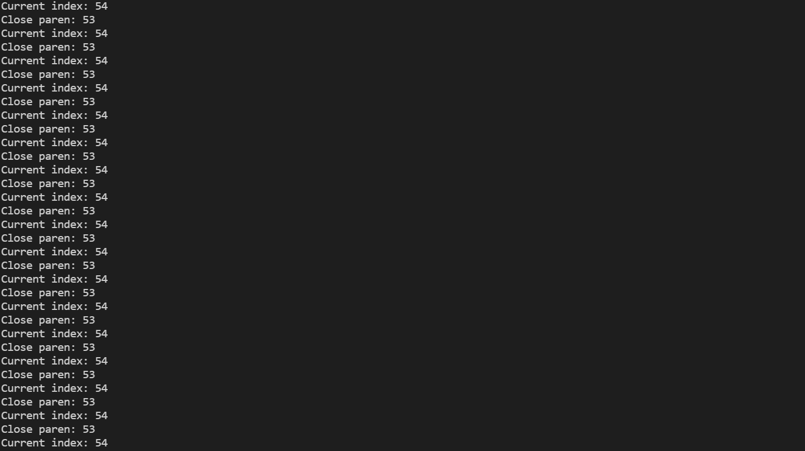
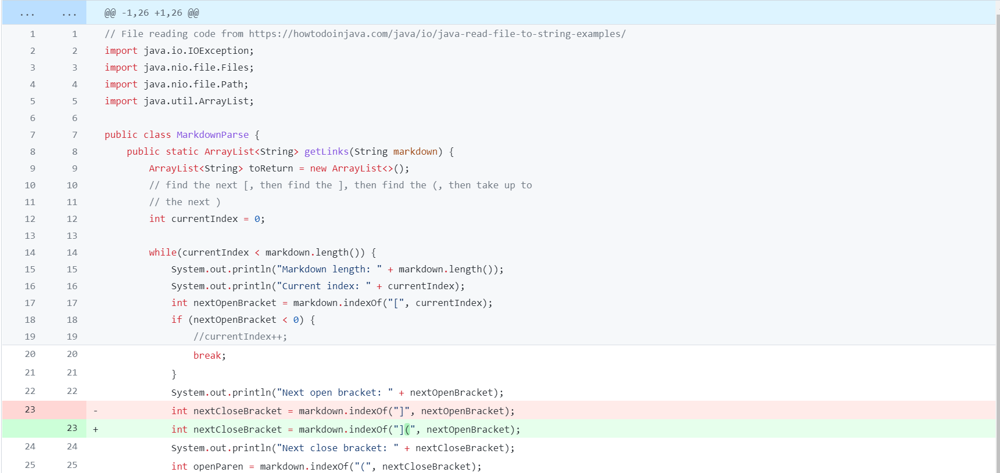
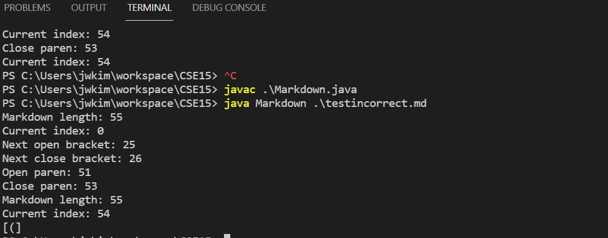

[Link of test file](https://github.com/AnniePhan02/markdown-parse/blob/main/testincorrect.md)

The symptom was that the code was printing the same two output repeatedly. This meant that the while loop in the code was not exiting which was caused by switching a close bracket[] with open brackets()

[Link of test file](https://github.com/AnniePhan02/markdown-parse/blob/main/test2incorrect.md)

The symptom was that the code printed out the incorrect contents. This likely meant that the code was picking the wrong set of paraenthesis in the input file which contained an extra pair of paranethesis that before the one that contains the link.

