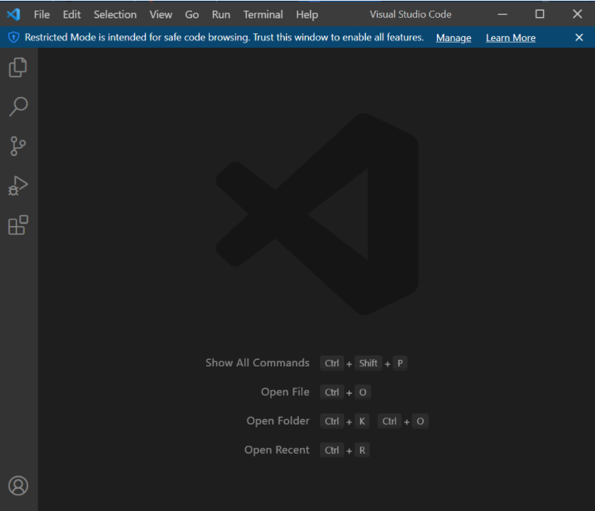
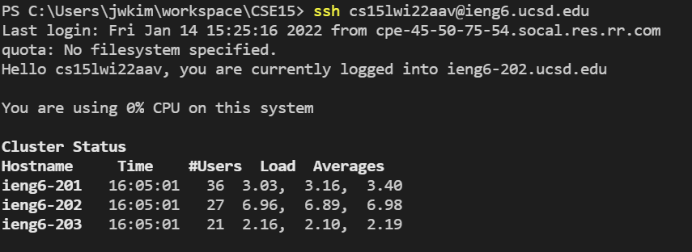
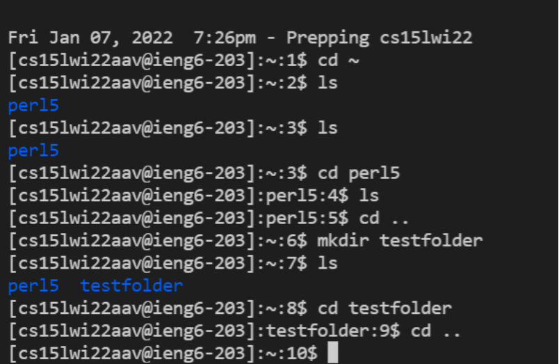
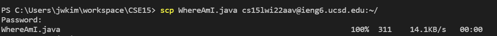
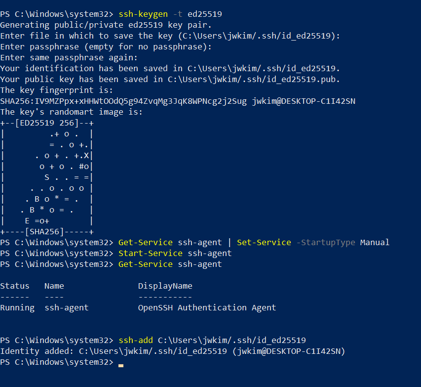
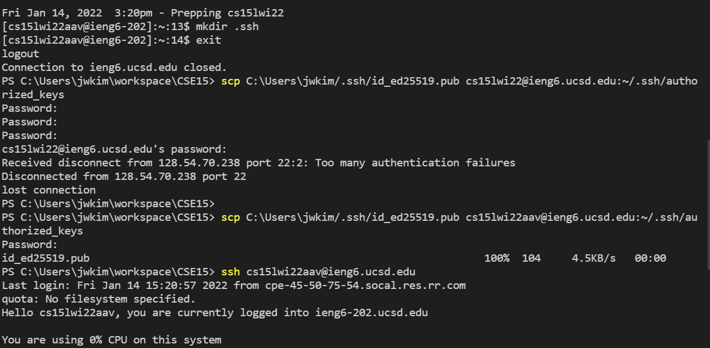
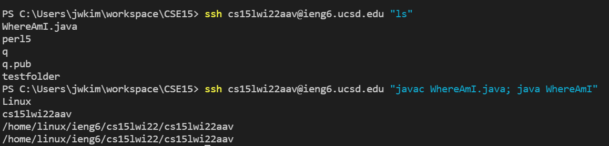

[Lab Report 1](https://richard21a.github.io/cse15l-lab-reports//lab-report-1-week-2.html)

# Step 1: Installing VScode

Visual studio code is an editor commonly used to write code. You can download it for free on the internet. After downloading it, open VS code and you should see this screen:

# Step 2: Remotely Connecting

We're going to connect to the computers in UCSD using ssh. In order to do this, we need to first reset our password for ssh account for CSE15l. I found this works most reliably in windows explorer. After resetting the password, log in to ssh using the command shown below:

# Step 3: Trying some Commands

Now we are going to try out some essential commands that we can use in the terminal. Examples of these commands being run is shown below:

# Step 4: Moving files with SCP

Now we are going to learn how to move files from client(your computer) to server(ssh). To do this, run the following command in your own computer terminal.

# Step 5: Setting up ssh keys

Notice that we have to put in our password whenever we log into ssh or put a file in. There is a way to bypass this and that is by setting up ssh keys. The process of achieving this is shown below:

# Part 6: Optimize remote setting:

In addition to ssh keys, there are several ways to optimize a remote enviroment. One way is to write whatever commands that you want to run in quotes at the end of the ssh command. This will make it so that after you enter ssh the terminal will execute the command in quotes and exist the server without using the exit command.

