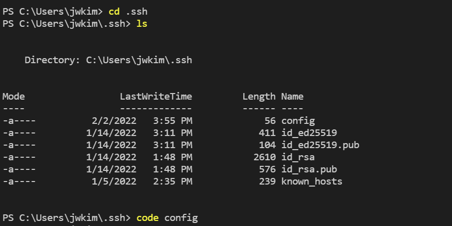
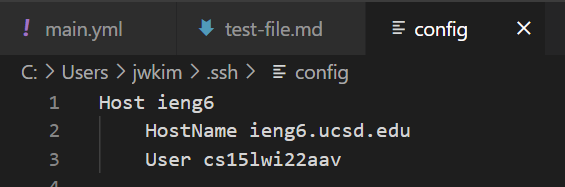
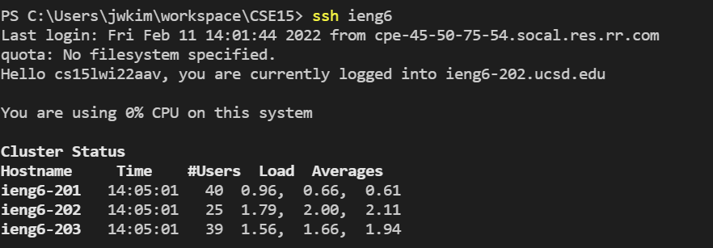
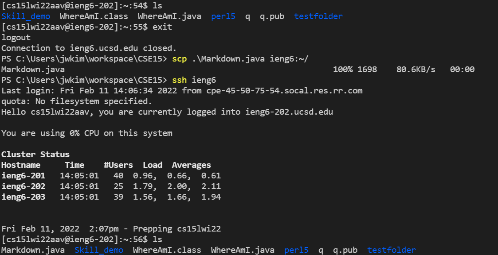

[Lab Report 1](https://richard21a.github.io/cse15l-lab-reports//lab-report-1-week-2.html)
[Lab Report 2](https://richard21a.github.io/cse15l-lab-reports/lab-report-2-week-4.html)

# Streamlining ssh configuration

Previously, we made logging into ssh easier by creating an ssh key. Now we will make this process even simpler by editing the config file of ssh. 

To start, first enter the .ssh directory in your own pc by typing `cd .ssh`

In the .ssh directory, there is a file called config. We will edit this file to achieve the streamlining. To open config in VScode, type the command `code config` and type the following code:

Note: For user, type your own unique account for ssh.

After editing the config file, we can log in to ssh by just typing `ssh ieng6`.

We can also apply this shortcut to adding files using scp. Now, to add files from the client to server, we can type `scp filename ieng6:~/`.

With this setup we now save approximately 20 keystrokes for both logging into ssh and adding files to ssh.