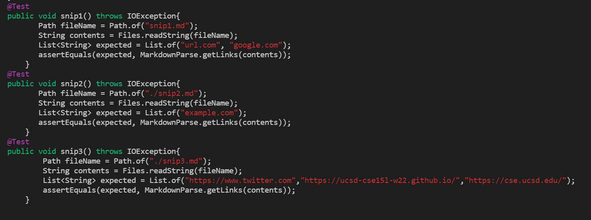
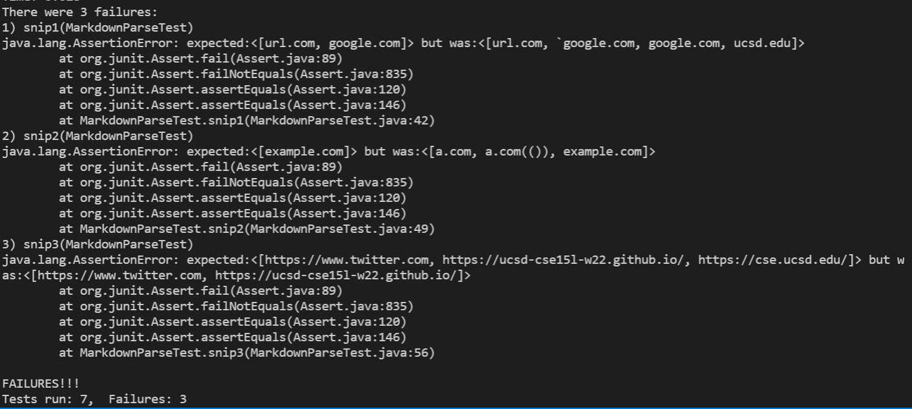
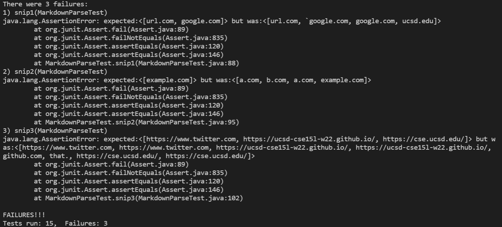

[Lab Report 1](https://richard21a.github.io/cse15l-lab-reports//lab-report-1-week-2.html)
[Lab Report 2](https://richard21a.github.io/cse15l-lab-reports/lab-report-2-week-4.html)
[Lab Report 3](https://richard21a.github.io/cse15l-lab-reports/lab-report-3/lab-report-3-week-6.html)
[Lab Report 5](https://richard21a.github.io/cse15l-lab-reports/lab-report-5/lab-report-5-week-10.html)
# Lab Report 4

[Our Repository](https://github.com/AnniePhan02/CSE15L-Panther)

[Repository that we reviewed](https://github.com/ShashankVenkatramani/markdown-parse/)

By using the preview feature in VScode, I determined the valid links each snippet:

Snippet 1: [url.com, google.com]

Snippet 2: [a.com, example.com]

Snippet 3: [https://www.twitter.com, https://ucsd-cse15l-w22.github.io/, https://cse.ucsd.edu/]

MarkdownParseTest.java to test the 3 snippets

All three tests failed for both our repo and the other team's repo:

Junit output for our implementation

Junit output for the other team's implementation

Possible solutions for snippet 1: For this, we will need to find the index of backticks and make sure that anything inside code blocks are ignored. However, the problem gets more complicated when considering the fact that there could be multiple code blocks in a line. Whatever is between the code block would still be between backticks but could still be a valid link. To keep track of all these complexities, we would need to make a lot of adjustments.

Possible solution for snippet 2: The problem for snippet 2 could be fixed by making the next closed bracket be the last bracket in the line. This could be achieved by using a while loop that ends after it encounters a new line. As for the second problem with nested parenthesis, we can add to our conditional so that if there are certain characters in the link(like "(") it ignores it.

Possible solution for snippet 3: The output for this snippet was mostly correct with the only issue being when the closed parenthesis is a few lines away. It appears that the findCloseParen method is incorrectly returning -1 for the last link. This is likely fixed by slightly changing the conditionals used for findCloseParen so that it can deal with new lines.