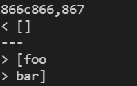

[Lab Report 1](https://richard21a.github.io/cse15l-lab-reports//lab-report-1-week-2.html)
[Lab Report 2](https://richard21a.github.io/cse15l-lab-reports/lab-report-2-week-4.html)
[Lab Report 3](https://richard21a.github.io/cse15l-lab-reports/lab-report-3/lab-report-3-week-6.html)
[Lab Report 4](https://richard21a.github.io/cse15l-lab-reports/lab-report-4/lab-report-4-week-8.html)

# Lab Report 5

Using the ``bash script.sh > file_name.txt`` command, I ran all of the 1000+ test cases on both our implementation of markdown parse and the implementation that was given to us. I stored the result from our implementation in ``results.txt`` and the result from the other implementation in ``result.txt``. I then compared the two files by running the command ``diff result.txt results.txt``. A sample of the output is shown below:

# Test 1:

The testfile: 194.md

Running this test outputs `[url]` from the given implementation and `[]` from our implementation.

Using the preview feature of VScode, I found that the test file contains no links which means that the given implementation wronly detected "url" as a link.

The issue with the given implementation is that it doesn't take into account that the open parenthesis should immedietly follow the close bracket ([Source](https://spec.commonmark.org/0.30/#links)). To fix this, there needs to be a conditional in the part of the code shown below that checks the location of the open parenthesis and skip to the next block or return if it does not immedietly follow the close bracket.

# Test 2

The testfile: 489.md

Running this test outputs `[]` from the given implementation and 
`[foo + "\n" + bar]` from our implementation.

Using the preview feature of VScode, I found that the test file contains no links which means that our implementation wronly detected "foo" + "\n" + "bar" as a link.

The issue with our implementation is that it fails to account for the fact that there can't be a new line in the middle of a link ([Source](https://spec.commonmark.org/0.30/#links)). To fix this, there needs to be a conditional in the part of the code shown below that checks if there is a new line between the open and closed parenthesis and skip to the next block or return if there is a new line.

